# ELM forecast — analysis results

All figures generated by `analysis/run_all.py`. N=6 usable shots (129038 dropped: signal_ok=False). Treat as framework + preliminary.

## Geometry
- 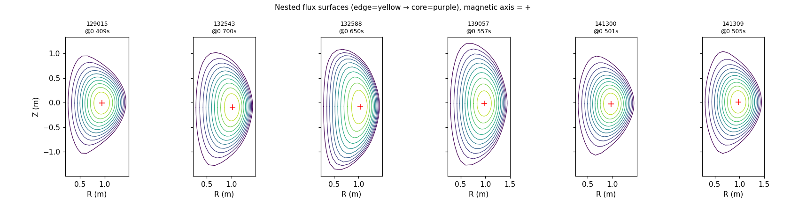
- 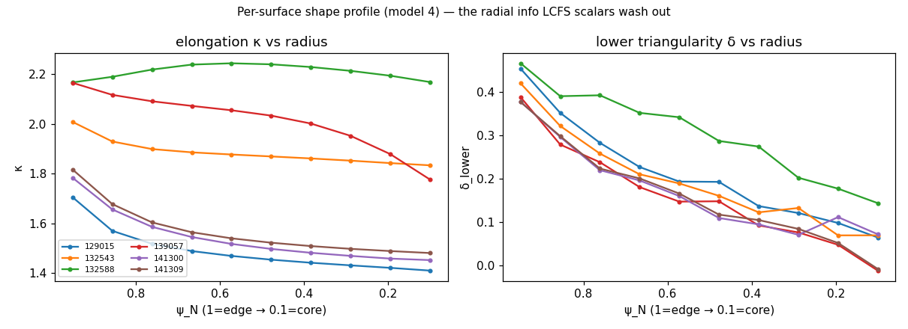
- 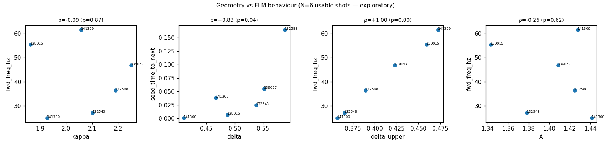  ([table](geometry/shape_table.csv))

## ELM labels
- 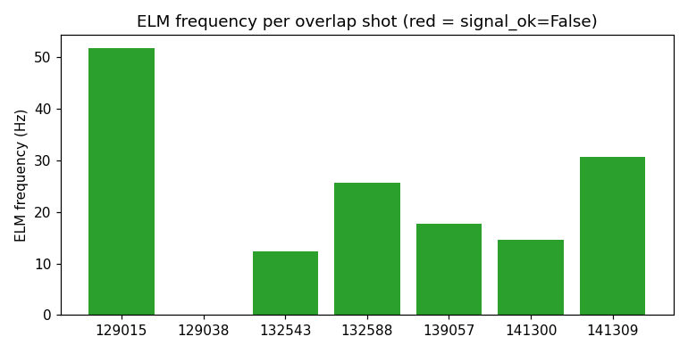  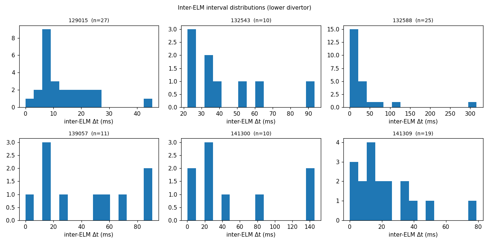

## Geometry → ELM baseline (leave-one-shot-out)
- 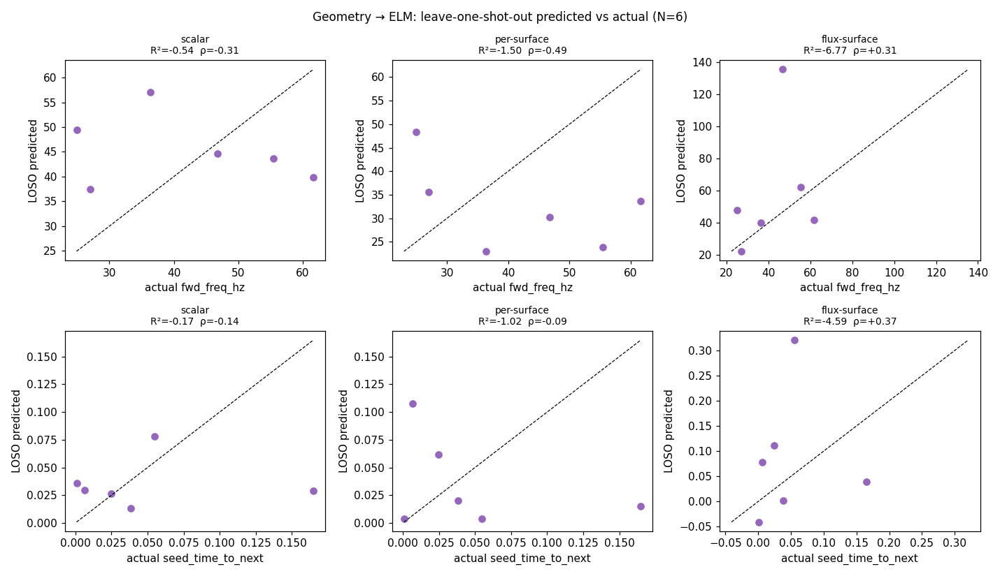  ([metrics](baseline/metrics.csv))
```
           target        model  R2_loso   RMSE    MAE  spearman  spearman_p
      fwd_freq_hz       scalar   -0.541 17.104 15.211    -0.314       0.544
      fwd_freq_hz  per-surface   -1.503 21.799 20.243    -0.486       0.329
      fwd_freq_hz flux-surface   -6.769 38.402 24.431     0.314       0.544
seed_time_to_next       scalar   -0.175  0.060  0.041    -0.143       0.787
seed_time_to_next  per-surface   -1.015  0.078  0.060    -0.086       0.872
seed_time_to_next flux-surface   -4.589  0.131  0.105     0.371       0.468
```

## Cox PH hazard (inter-ELM survival) — the geometry comparison
Baseline = no geometry (C=0.5). Leave-one-shot-out C-index, per-fold PCA (no leak); `random(ctrl)` = random per-shot constant.
- 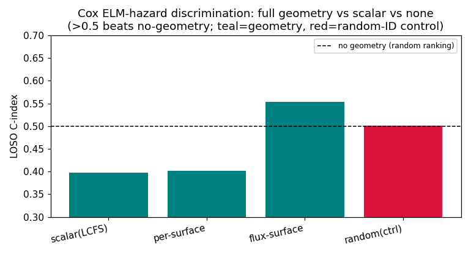
- 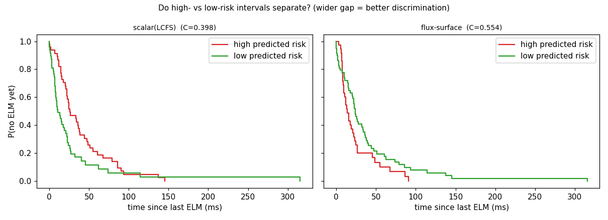
- 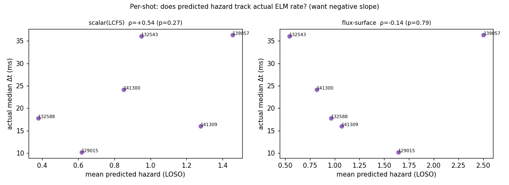  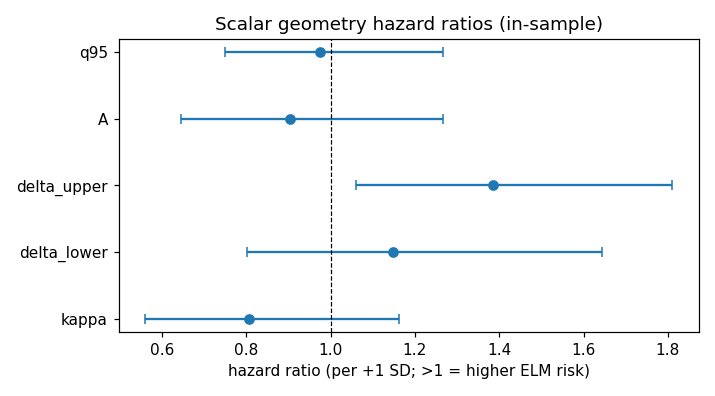
```
       model  C_loso
scalar(LCFS)   0.398
 per-surface   0.402
flux-surface   0.554
random(ctrl)   0.501


              coef  exp(coef)  se(coef)  coef lower 95%  coef upper 95%  exp(coef) lower 95%  exp(coef) upper 95%  cmp to      z      p  -log2(p)
covariate                                                                                                                                        
kappa       -0.215      0.806     0.186          -0.581           0.150                0.560                1.162     0.0 -1.155  0.248     2.010
delta_lower  0.138      1.148     0.183          -0.221           0.497                0.801                1.644     0.0  0.753  0.451     1.147
delta_upper  0.326      1.386     0.136           0.059           0.593                1.061                1.810     0.0  2.394  0.017     5.908
A           -0.101      0.904     0.172          -0.438           0.235                0.645                1.265     0.0 -0.590  0.555     0.850
q95         -0.026      0.974     0.134          -0.288           0.236                0.750                1.266     0.0 -0.197  0.844     0.245
```

## Reservoir ELM predictor (forecast D-alpha 20 ms ahead) + geometry-as-input ablation
Geometry injected as reservoir input channels; pooled time-split (train on early half of all shots, forecast later half). `+random(ctrl)` = random per-shot constant.
- 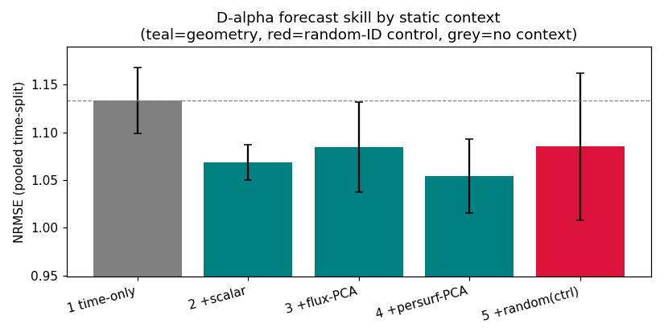  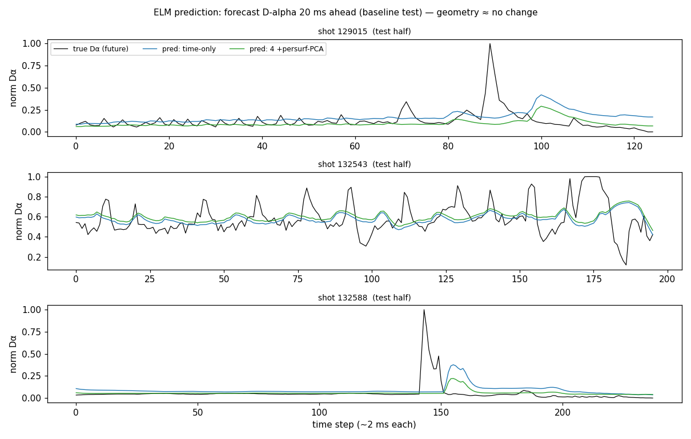
```
          model  nrmse   std
    1 time-only  1.133 0.035
      2 +scalar  1.068 0.018
    3 +flux-PCA  1.084 0.047
 4 +persurf-PCA  1.054 0.039
5 +random(ctrl)  1.085 0.077
```
_Geometry improves ~5% but the random-ID control improves the same — the gain is per-shot specialization, not geometry physics._
